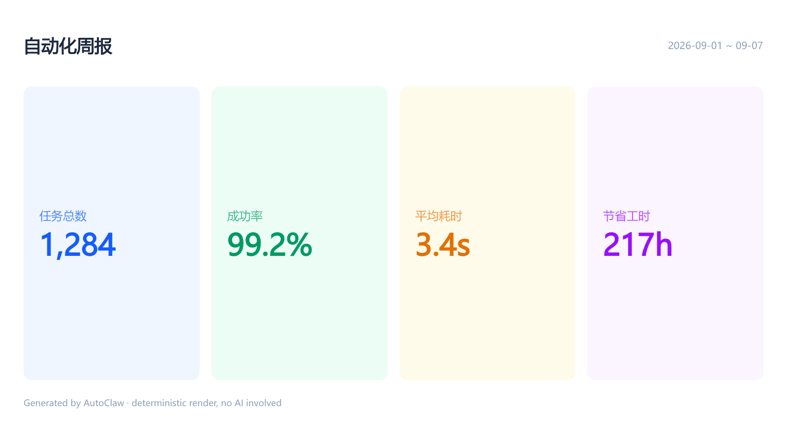
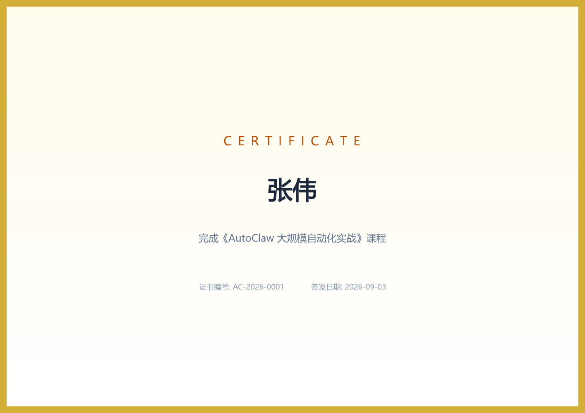

# Rendering Examples (`render_image` / `render_pdf`)

Runnable examples for AutoClaw's deterministic rendering tools. Each case pairs a real-world scenario with the exact template the agent writes, plus the rendered output committed next to it.

Reproduce everything after `npm run build`:

```bash
node examples/render/run.mjs
```

> Templates use the `tw` attribute for Tailwind v4 utilities (the `class` attribute only matches regular CSS selectors), and rely on auto-detected system fonts — install `font-noto-cjk` (Alpine) or `fonts-noto-cjk` (Debian) in containers for CJK text.

## Cases

### 1. OG share card — `output/og-card.png`
Blog/social share image with brand mark, headline and pill badges. The classic SEO use case: one card per post.
```bash
autoclaw "Read the title and summary of every .md file in content/posts/ and render an OG share image (1200x630) for each into public/og/" -y -n
```


### 2. Social poster — `output/social-post.png`
1080x1080 square post for Xiaohongshu/WeChat/Instagram — big CJK typography over a brand gradient.
```bash
autoclaw "Render a 1080x1080 social post promoting our weekly newsletter: bold hook headline, brand gradient background" -y -n
```


### 3. Metrics card — `output/metrics-card.png`
KPI summary card for weekly ops reports, dashboards or chat-group pushes — precise numbers, zero AI randomness.
```bash
autoclaw "Aggregate this week's automation stats into a KPI card (1600x900) with task count, success rate, average duration and hours saved" -y -n
```


### 4. Weekly report PDF — `output/weekly-report.pdf`
One-page A4 ops report under cron/CI: KPI row plus a bar chart built from plain `div`s — no JS, no chart library. Deterministic output means CI can diff two renders byte-for-byte.
```bash
autoclaw "Aggregate this week's nginx access log into a one-page A4 PDF report with a metrics table and save it as report.pdf" -y -n
```

### 5. Vector badge — `output/badge.svg`
SVG output scales infinitely — shields, badges, release tags for docs and READMEs.
```bash
autoclaw "Render a release badge for render_pdf as SVG into assets/badge.svg" -y -n
```


### 6. Certificate — `output/certificate.png`
Personalized certificates from an attendee list. Measured at ~67 ms per certificate — a 200-person batch finishes in seconds.
```bash
autoclaw "Read attendees.json and render a completion certificate (1414x1000) for each attendee into certs/, numbered from AC-2026-0001" -y -n
```


### 7. Animation — `output/animation.webp`
CSS `@keyframes` sampled across time into an animated WebP (GIF/APNG also supported) — loading indicators, social motion posts, simple motion graphics. ~167 KB for 1.2s at 30fps, rendered offline.
```bash
autoclaw "Render a 480x480 looping brand animation: pulsing rings around the logo mark, 1.2s at 30fps, animated WebP" -y -n
```


### 8. Multi-page purchase order — `output/invoice.pdf`
60-line CJK table flowing across 3 A4 pages: `<thead>` repeats on every page, footer band carries `第 X 页 / 共 Y 页` counters, document title lands in the PDF metadata. Renders in ~400 ms with no browser.
```bash
autoclaw "Read orders.csv, render a PDF invoice for each order into invoices/ (A4, page-number footer), then email every invoice to the customer address in its row" -y
```

### 9. Emoji behavior — `output/emoji.png`
Emoji render in full color via the Twemoji CDN by default — fully offline environments should keep templates text-only (CJK is unaffected; it uses local fonts).


## Real agent output — `agent-run/`

One headless run, real model, no manual edits — the agent planned the design, called both new tools and verified its own output:

```bash
autoclaw "Render an OG image for the AutoClaw v1.4 release (dark gradient, title AutoClaw v1.4) and a one-page A4 PDF brief introducing the two new render tools" -y -n
```

| File | What it is |
| :--- | :--------- |
| `agent-run/agent-og.png` | OG image designed and rendered by the agent |
| `agent-run/agent-brief.pdf` | One-page A4 PDF brief written by the agent |
